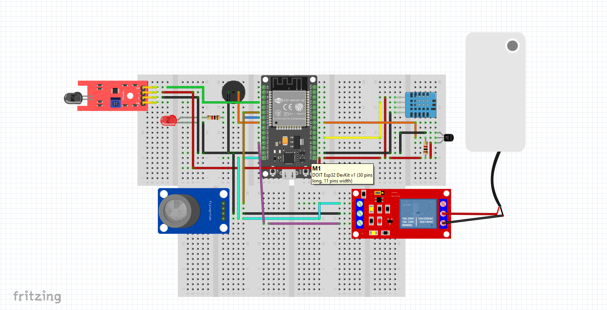
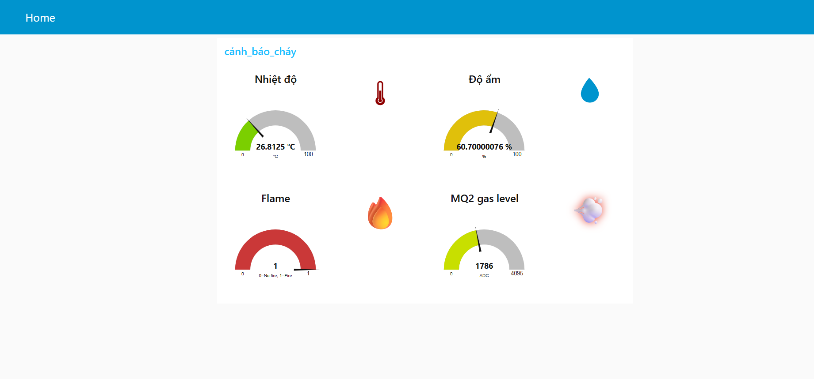
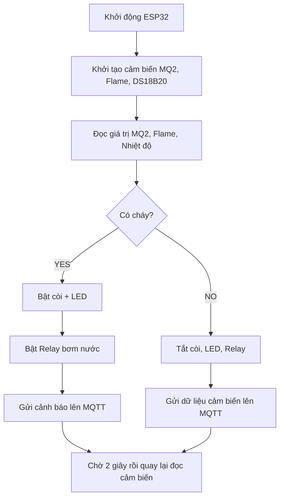

# HỆ THỐNG CẢNH BÁO CHÁY THÔNG MINH

## 1. Giới thiệu & Đặt vấn đề

Hỏa hoạn là một trong những tai nạn nguy hiểm gây thiệt hại lớn về người
và tài sản. Một hệ thống cảnh báo cháy tự động, thời gian thực, độ tin
cậy cao là vô cùng quan trọng.

Dự án xây dựng hệ thống cảnh báo cháy IoT có khả năng:

-   Phát hiện khói, lửa, nhiệt độ cao
-   Kích hoạt còi + đèn cảnh báo
-   Phun nước tự động khi cháy
-   Gửi dữ liệu cảm biến lên MQTT Cloud
-   Điều khiển còi/bơm từ xa qua Internet
-   Gửi cảnh báo qua email qua Node-RED

Hệ thống sử dụng ESP32, ưu điểm: rẻ, mạnh, WiFi tích hợp, dễ mở rộng.

## 2. Phần cứng sử dụng

-   ESP32 DevKit V1
-   MQ2 --- cảm biến khói
-   Flame IR --- cảm biến lửa
-   DS18B20 --- cảm biến nhiệt độ
-   Relay 1 kênh điều khiển bơm
-   Máy bơm mini 5
-   Buzzer + LED cảnh báo
-   Nguồn 3.3V - 5V tùy thiết bị

## 3. Sơ đồ kết nối

MQ2 (AO) → ESP32 GPIO32\
Flame (DO) → ESP32 GPIO34\
DHT11 -> ESP32 GPIO4\
DS18B20 → ESP32 GPIO5\
Buzzer → ESP32 GPIO25\
LED → ESP32 GPIO33\
Relay (bơm) → ESP32 GPIO12\

## 4. Kiến trúc hoạt động

\[Sensors\] → \[ESP32 xử lý dữ liệu\] → (Buzzer + LED, Relay, MQTT
Cloud)

## 5. MQTT Cloud

-   Server: HiveMQ Cloud
-   Kết nối bảo mật TLS
-   ESP32 publish dữ liệu mỗi 2 giây

Topic: flame-alarm-sensor

## 6. Node‑RED Flow & Email Alert
Node-RED được dùng để:
-   Nhận dữ liệu từ MQTT 
-   Kiểm tra xem cảm biến có báo cháy hay không
-   Gửi email cảnh báo tự động khi phát hiện cháy 

Node-RED có thể gửi email:
-   Nội dung cảnh báo
-   Trạng thái cảm biến 
-   Thời gian xảy ra cảnh báo 

## 7. Demo

-   Video: 

-   Hình ảnh: 

## 8. Hướng dẫn chạy

git clone `<repo>`\
Mở bằng PlatformIO\
Cấu hình WiFi & MQTT trong config.h\
Upload code vào ESP32\
Mở Serial Monitor để xem dữ liệu

## 9. Flowchart hoạt động hệ thống

## 10. Kết luận

Hệ thống hoạt động ổn định và hiệu quả:

-   Phát hiện cháy nhanh
-   Tự động kích hoạt còi + đèn
-   Tự bật bơm phun nước
-   Truyền dữ liệu lên cloud theo thời gian thực
-   Gửi được cảnh báo về email
-   Chi phí thấp -- dễ lắp đặt -- dễ mở rộng

Hướng phát triển: - Tích hợp Camera AI nhận diện cháy 
                  - Tích hợp LoRa / 4G để hoạt động không cần WiFi
